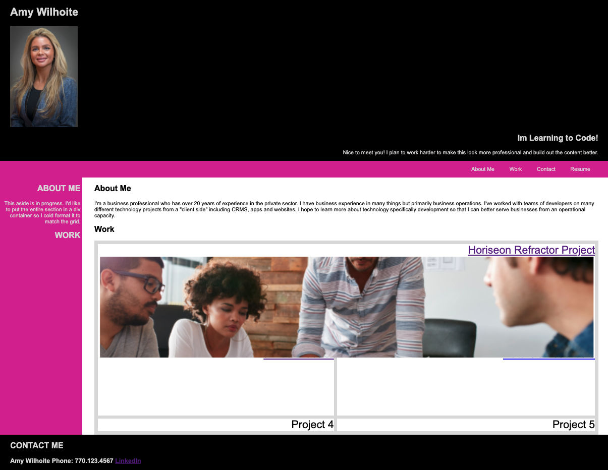

# homework2
2: Professional Portfolio

## Overview

Hi! I am Amy Wilhoite and this is my professional portfolio I've created to display my work product.
 
My goals in this project are to deploy new skills while keeping in mind the user story of my future employer:
 
* flexbox
* media queries 
* CSS variables 

This work contains:
* my previous work
* my contact info, a recent photo or avatar, and links to sections about me, my work
* nav links correlate to corresponding sections
* images link to corresponding work
* css reset implemented 
* responsive layout

## Preview

## Links
* https://github.com/AmyWilhoite/homework2.git
* https://github.com/AmyWilhoite/homework2